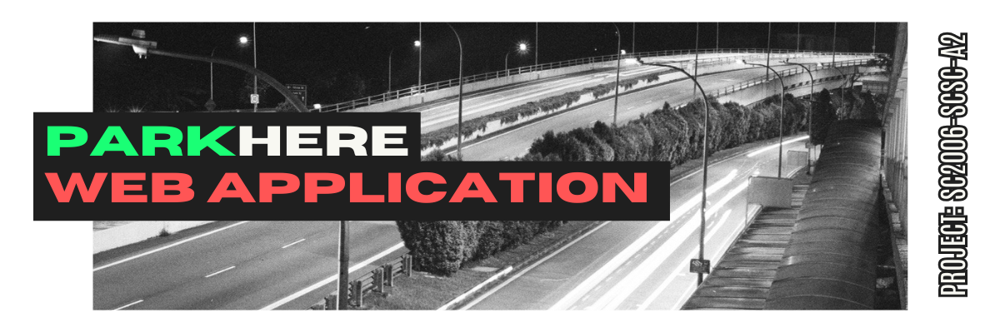
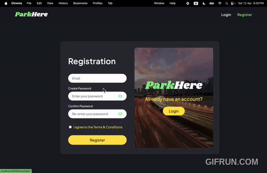

<p align="center">
  
</p>



# 📦 ParkHere — Group Project
A Django-based web application that enables users to search for carparks, view real-time availability, and interact with a dynamic map interface. Admin users can manage and monitor the carpark system.
---

## Table of Contents
- [Lab Deliverables](#lab-deliverables)
- [ParkHere Web Application](#parkhere-web-application)
- [Project Structure](#project-structure)
- [Features](#features)
- [Setup Instructions](#setup-instructions)
  - [Docker-Based Deployment](#docker-based-deployment)
- [Pre-Configured Users](#pre-configured-users)
- [Notable Files](#notable-files)
- [Documentation](#documentation)
- [App Design](#app-design)
  - [SE Practices](#software-engineering-practices)
  - [Tech Stack](#tech-stack)
- [External APIs](#external-apis)
- [Contributors](#contributors)


## Lab Deliverables

### ✅ Lab 1
**Deliverables**
```
• Functional and Non-functional Requirements
• Data Dictionary
• Initial Use Case Model
• UI Mockups
```

**Files**
- `UPDATED DIAGRAMS` - [In Lab 5 Directory](/Lab%205/)
- `Lab1_Deliverables.pdf` — Contains all Lab 1 items.
- `UseCaseDiagram_Lab1.png` — Optional zoomed version for clarity.
---

### ✅ Lab 2
**Deliverables**
```
• Complete Use Case Diagram
• Use Case Descriptions
• Class Diagram (Entities, Boundaries, Control)
• Sequence Diagrams (Selected)
• Dialog Map
```

**Files**
- `UPDATED DIAGRAMS` - [In Lab 5 Directory](/Lab%205/)
- `Lab2_Deliverables.pdf` — Main submission.
- `Lab2_Diagrams.pdf` — Optional reference diagrams.

---

### ✅ Lab 3
**Deliverables**
```
• Full Use Case Model
• Design Model (Class Diagrams, Sequence Diagrams, Dialog Map)
• System Architecture
• Application Skeleton
```

**Files**
- `UPDATED DIAGRAMS` - [In Lab 5 Directory](/Lab%205/)
- `Lab3_Deliverables.pdf`

---

### ✅ Lab 4
**Deliverables**
```
• Working Prototype
• Source Code
• Test Cases & Results
• Demo Script
```

---

### ✅ Lab 5
**Deliverables**
```
• Final Version of all Documentation and Diagrams
• Demo Video Link
```
**Files**
- `UPDATED DIAGRAMS` - [In Lab 5 Directory](/Lab%205/)
- [Project Demo Video](https://youtu.be/J2KZ5TghmPU)

---

# ParkHere Web Application

A Django-based web application that enables users to search for carparks, view real-time availability, and interact with a dynamic map interface. Admin users can manage and monitor the carpark system.

---

## Project Structure

This project is organized as follows:

```
parkHereWebApp/
├── adminHandler/        # Admin site customizations and views
├── carparkHandler/      # Handles carpark data views and models
├── mapHandler/          # Contains APIs and models related to map and carpark info
├── parkHereWebApp/      # Django project settings and URLs
├── static/              # Static files (CSS, JS, images)
├── templates/           # HTML templates (if any)
├── db.sqlite3           # Default SQLite database (for local dev)
├── manage.py            # Django's command-line utility
├── Dockerfile           # Docker instructions
├── compose.yml          # Docker Compose setup
└── requirements.txt     # Python dependencies
```

---

## Features

- MapBox-Powered Map with Live Carpark Markers & Parking Availability
- Peak Hour Detection
- Admin Dashboard for Carpark Management
- Custom Django commands (e.g. data import schedulers)
- Dockerized setup for easy deployment

---

## Setup Instructions

### Docker-Based Deployment

> Ensure Docker and Docker Compose are installed on your machine.

1. **Clone the Repository**

```bash
git clone https://github.com/softwarelab3/2006-SCSC-A2.git
cd parkHereWebApp
```

2. **Build and Start Containers**

```bash
docker-compose -f compose.yml up --build
```

3. **Access the App**

- Open your browser and go to: `http://localhost:8000/`
- Admin Panel: `http://localhost:8000/admin/`

---
## Pre-Configured Users

| Email |Password  |
|-------|-------------------|
| admin@parkhere.com | SC2006!! |
---

## Notable Files

- `Dockerfile`: Defines Docker environment for Django
- `compose.yml`: Combines Django app and services
- `runImportScheduler.py`: Custom Django management command to import carpark data
- `serializers.py`: DRF serializers for REST APIs
- `static/`: Includes mapbox JS/CSS and other frontend assets
---

## Documentation

- Architecture Diagrams
- Use Case Diagrams
- Sequence Diagrams
- Class Diagrams
- Dialog Maps
---

## Software Engineering Practices

### **Single Responsibility Principle (SRP)**

**Separation of Concerns**:  
The codebase is organized into distinct Django apps, each handling a specific domain of the system:
- `adminHandler`: Manages admin-specific operations
- `mapHandler`: Handles map-related functionality
- `userHandler`: Manages user-related operations

**View Separation**:  
Responsibilities are clearly separated across files:
- `views.py`: Contains logic for handling requests and responses
- `serializers.py`: Manages data serialization and transformation
- `models.py`: Defines the structure of data and database schemas

### **Open/Closed Principle (OCP)**

**Extensible Models**:  
- The `Carpark` model and other data models are designed to be extended without modifying existing code structures.
- New attributes or logic can be added through subclassing or migration without breaking existing functionality.

**Template Inheritance**:  
- Django's template inheritance allows extending base templates (like `base.html`) with minimal changes, supporting modular UI development.


### **Liskov Substitution Principle (LSP)**

- All models inherit from `django.db.models.Model`, ensuring they behave consistently and can be substituted wherever a Django model is expected.


### **Interface Segregation Principle (ISP)**

**Focused Serializers**:  
- Serializers are designed with specific use cases in mind, including only relevant fields needed for a particular API or view, promoting clarity and efficiency.

### **Dependency Inversion Principle (DIP)**

**Use of Django’s Abstractions**:  
- Django’s ORM abstracts database operations, allowing higher-level modules (like views and services) to depend on interfaces rather than concrete implementations.
- Custom logic, if any, follows the pattern of depending on Django’s reusable services or injected components.

## Tech Stack

### 🖥 Backend
- **Python 3.11** – Core programming language
- **Django 5.x** – Web framework for handling routing, authentication, and admin
- **Django REST Framework (DRF)** – For building RESTful APIs
- **SQLite** – Default database used during development (easily swappable for PostgreSQL)

### 🌍 Frontend
- **HTML, CSS, JavaScript** – Basic frontend structure and interactivity
- **Mapbox GL JS** – Interactive maps and carpark marker overlays
- **Bootstrap 5** – (Optional) For styling if you're using it in templates

### 🐳 Deployment & DevOps
- **Docker** – Containerized Django application
- **Docker Compose** – Orchestration for multi-service setup
- **Gunicorn**  – Python WSGI HTTP server for production

### 🧪 Development Tools
- **VS Code** – Recommended editor
- **Postman** – API testing
- **Git** – Version control

---

## External APIs

- **Mapbox API**  
  Provides map rendering, place search, geocoding, and navigation services.  
  📄 [Documentation](https://docs.mapbox.com/#maps)

- **HDB Carpark Information API**  
  Supplies static data such as carpark locations, types, and coordinates.  
  📄 [Dataset Link](https://data.gov.sg/datasets/d_23f946fa557947f93a8043bbef41dd09/view)

- **HDB Carpark Availability API**  
  Offers real-time updates on carpark availability across Singapore.  
  📄 [Dataset Link](https://data.gov.sg/datasets/d_ca933a644e55d34fe21f28b8052fac63/view)

---

## Contributors

| Name |
|------|
| Revathi Selvasevaran | --- |
| Ariel Jan Matthew Mudjadi | --- |
| Chua Hui Ting Sharon | --- |
| Gao Jun | --- |
| Huang Bin | --- |

---
